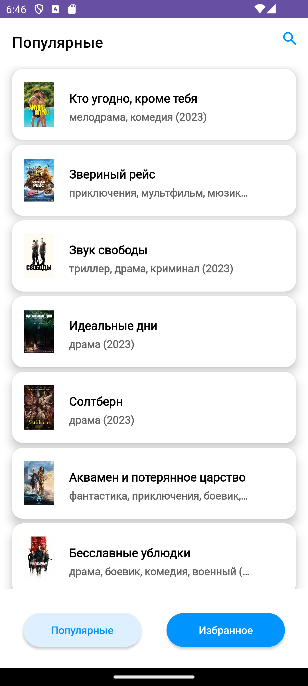
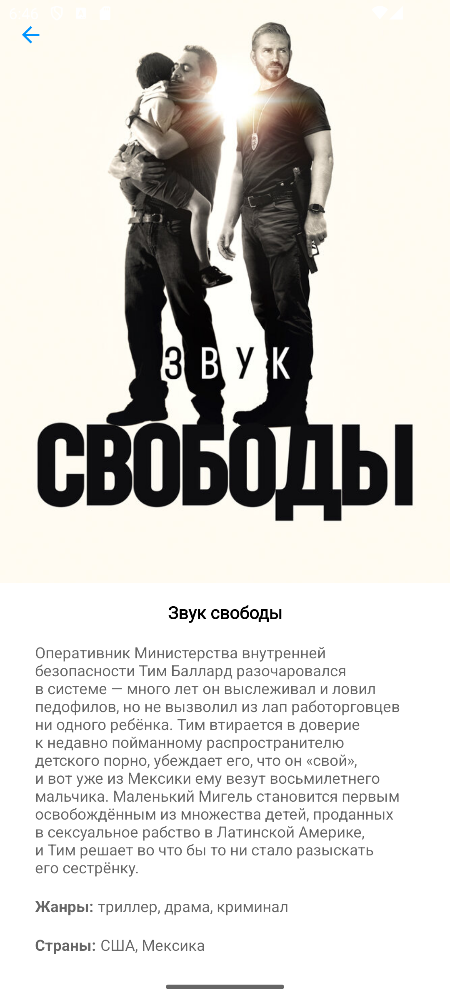
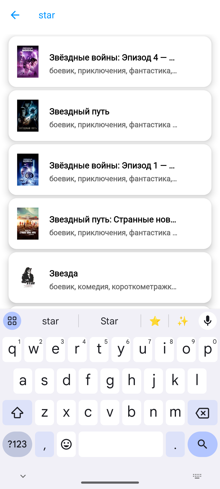

# View Kinopoisk 

Kinopoisk Viewing Application for Android

Written in Kotlin

Uses libraries: Dagger2, Retrofit,  Coroutines, Gson, Glide

***

Приложение для выбора фильмов на Кинопоиске

Написано на Kotlin

Использованы библиотеки: Dagger2, Retrofit,  Coroutines, Gson, Glide

